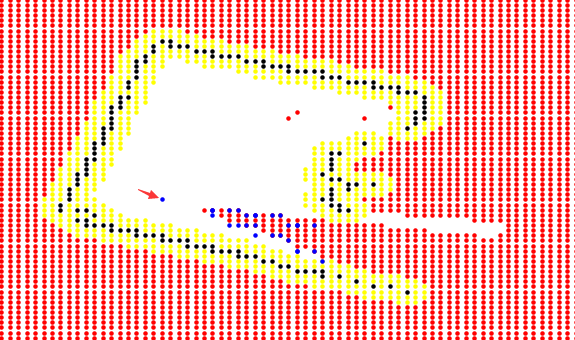

# SeExplorer

breadth first search begins from the current pose of robot and find the frontier betweens the unknowns and free space

then,we pick the centroid of the frontiers

the arrow is pointing to the current of robot , the red region means unknown space and the blue are the frontiers that we found 

next ,we publish the centroid of the frontiers as the goal to the globalplanner
